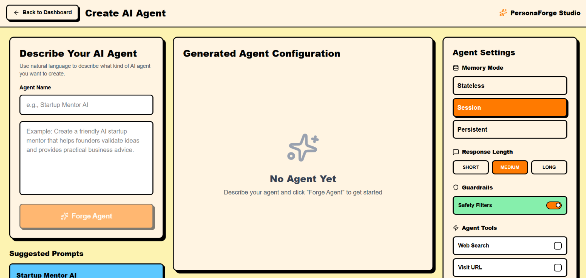
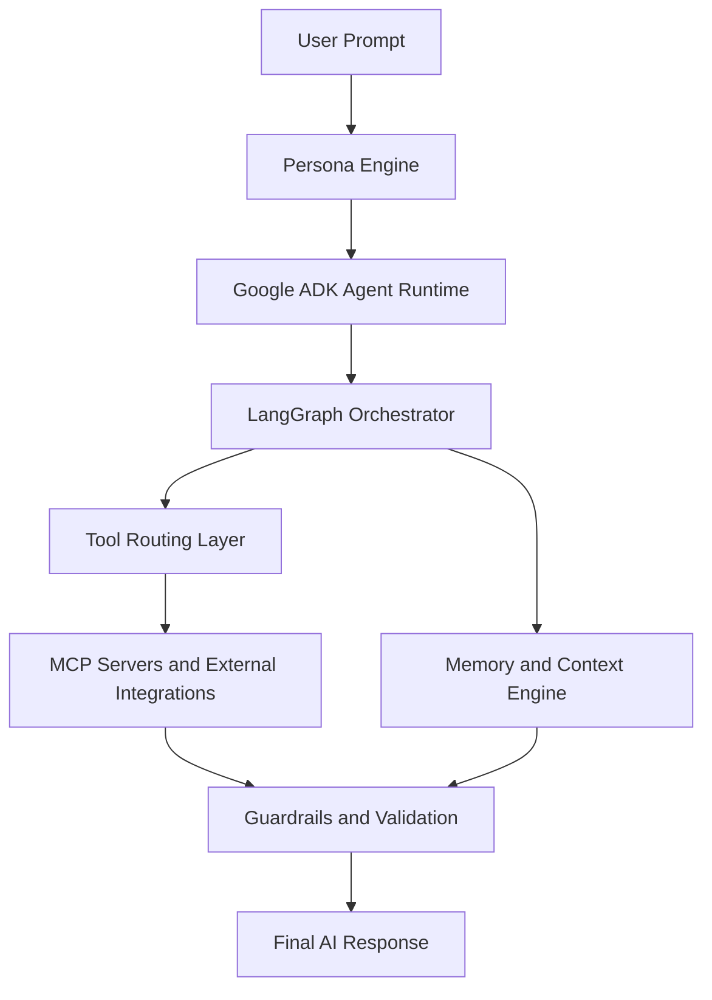
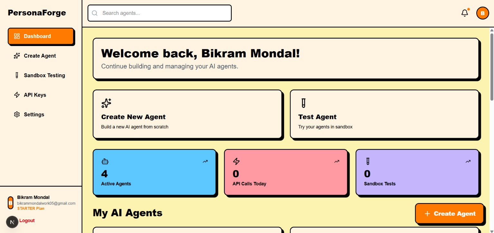
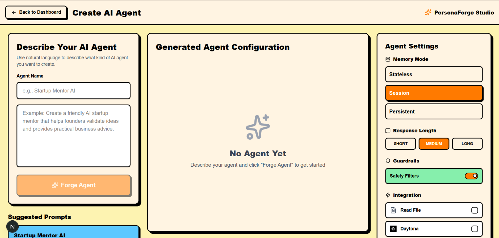
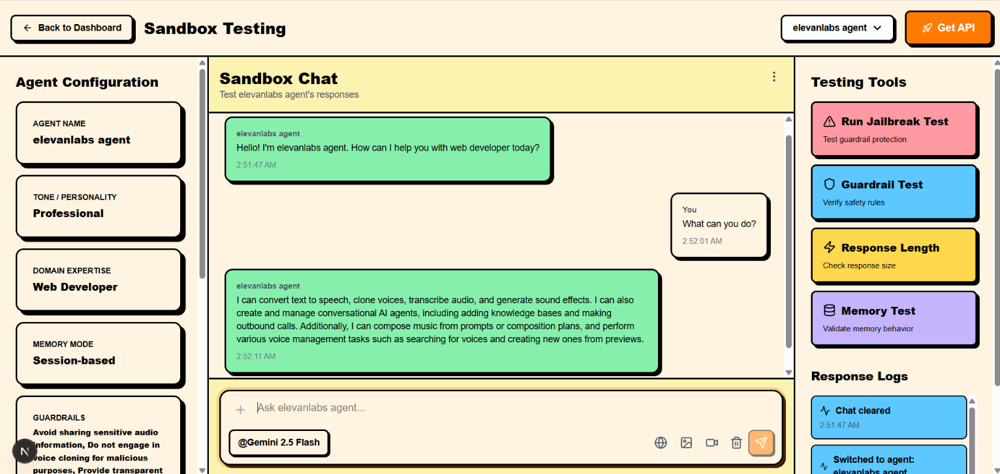

# 🤖🌟 PersonaForge – AI Agent Orchestration Platform



PersonaForge is a next-generation AI Agent Orchestration Platform that allows users to create powerful, persona-driven AI agents using natural language. The platform combines intelligent orchestration, memory systems, tool integrations, and safety guardrails to help developers build production-ready AI workflows without manually engineering complex multi-agent systems.

From web search to image generation, from video generation to workflow automation, PersonaForge transforms prompts into scalable, domain-specific AI specialists.

---

# ❗ Problem Statement

Building AI agents today is complex and fragmented. Developers must manually manage prompt engineering, workflow orchestration, memory systems, tool integrations, and safety guardrails. As agents become more advanced, maintaining reliable, secure, and context-aware behavior becomes increasingly difficult.

PersonaForge solves this by providing a unified platform to create safe, intelligent, persona-driven, and tool-augmented AI agents with simplified orchestration and scalable workflows.

# 🌟 Features

- 🤖 Persona-Driven AI Agents – Create domain-specific AI assistants with strict identity enforcement
- 🧠 Memory & Context Awareness – Maintain conversation history and stateful reasoning
- 🛡️ Multi-Layer Guardrails – Prevent jailbreaks, unsafe outputs, and persona drift
- 🔗 Tool-Augmented Intelligence – Connect agents with external tools and APIs
- 🌐 Real-Time Web Search – Retrieve and summarize live internet information
- 📄 File Intelligence – Analyze PDFs, datasets, and uploaded documents
- 🎤 Voice AI Integration – Enable speech generation and voice-enabled interactions
- ⚡ Multi-Agent Orchestration – Coordinate workflows using LangGraph & LangChain
- ☁️ Cloud-Ready Architecture – Built for scalable deployment and enterprise workflows
- 🧩 Extensible System – Easily integrate custom MCP servers and external services
- 🔐 Secure Authentication – OAuth-based login with Google and GitHub
- 🎨 Modern Developer Experience – Interactive UI with sandbox-style agent testing

---

# 🏗️ Architecture Overview

PersonaForge follows a layered AI orchestration architecture designed for scalability, safety, and intelligent workflow execution.



The platform combines persona enforcement, workflow orchestration, memory systems, and external tool integrations into a unified AI operating layer.

---

# 🛡️ Safety & Guardrails

PersonaForge includes multi-layer safety systems to ensure reliable and controllable AI behavior.

### Core Protection Layers
- Persona consistency enforcement
- Prompt injection resistance
- Identity lock system
- Unsafe output filtering
- Output validation & regeneration
- Domain-aware response checking

These mechanisms help agents remain safe, stable, and production-ready across long conversations and complex workflows.

---

# 🧩 Available Tools

| Tool | Description |
|------|-------------|
| 📂 Read File | Analyze uploaded files, PDFs, documents, and datasets |
| ⚡ Daytona | Execute code, run shell commands, and manage secure sandboxes |
| 🐙 GitHub MCP Server | Manage repositories, PRs, issues, commits, and GitHub workflows |
| 📧 AgentMail | Read, send, and manage emails with intelligent automation |
| 🎤 ElevenLabs | Generate speech, clone voices, transcribe audio, and create sound effects |
| 📝 Notion | Search workspaces, manage pages, databases, and collaborative content |
| 📮 Postman | Test APIs, manage collections, environments, and workflows |
| 🍃 MongoDB MCP | Query databases, manage collections, and interact with Atlas clusters |
| 🌐 Web Search | Retrieve live internet information and real-time web results |

---

# 🧠 Available Text Models

| Model Name | Internal Model ID |
|------------|------------------|
| Gemini 2.5 Flash | `gemini-2.5-flash` |
| Gemini 2.0 Flash | `gemini-2.0-flash` |
| Gemini 3.0 Flash | `gemini-3.0-flash` |
| OpenAI GPT-4o | `openai/gpt-4o` |
| Claude Haiku 4.5 | `claude-fast` |
| DeepSeek-V3 | `deepseek/DeepSeek-V3-0324` |
| Qwen3 Coder 30B | `qwen-coder` |
| Moonshot Kimi K2.5 | `kimi` |
| Zai GLM-5.1 | `glm` |
| Groq Llama 3.3 70B | `llama-3.3-70b-versatile` |
| Groq Llama 3.1 8B | `llama-3.1-8b-instant` |
| Gemini Flash Latest | `gemini-flash-latest` |

---

# 🎨 Available Image Generation Models

| Model Name | Internal Model ID |
|------------|------------------|
| FLUX.1 Kontext | `kontext` |
| FLUX.2 Klein 4B | `klein` |
| Flux Schnell | `flux` |
| GPT Image 1 Mini | `gptimage` |
| Qwen Image Plus | `qwen-image` |
| Wan 2.7 Image | `wan-image` |
| Z-Image Turbo | `zimage` |

---

# 🎬 Available Video Generation Models

| Model Name | Internal Model ID |
|------------|------------------|
| LTX-2.3 | `ltx-2` |
| Nova Reel | `nova-reel` |

---

# 🌍 Real-World Use Cases

PersonaForge can power intelligent AI workflows across multiple industries and domains.

### Example Applications
- Healthcare AI assistants
- Education and tutoring systems
- Research copilots
- Enterprise workflow automation
- API testing and developer tools
- Knowledge management platforms
- Voice-enabled assistants
- Productivity and scheduling automation
- Multi-agent business operations

The platform is designed to help developers and organizations deploy scalable AI systems with minimal orchestration complexity.

---

# 🛠️ Technologies Used

### 🎨 Frontend
- Next.js
- React
- TypeScript
- Tailwind CSS
- Framer Motion

### ⚙️ Backend
- Node.js
- Express.js
- Firebase Firestore
- Firebase Admin SDK
- Redis

### 🧠 AI & Orchestration
- Google ADK
- Gemini API
- MCP Servers

### 🔐 Authentication
- NextAuth.js
- Google OAuth
- GitHub OAuth

### 🔌 Integrations
- Notion API
- MongoDB MCP
- Postman MCP
- ElevenLabs
- DDGS Search API

---

# ⚙️ Installation

## 1️⃣ Clone the repository

```bash
git clone https://github.com/your-username/personaforge.git
```

## 2️⃣ Navigate to the project directory

```bash
cd personaforge
```

## 3️⃣ Install dependencies

```bash
npm install
```

## 4️⃣ Configure environment variables

Create a `.env` file and add:

```env
GEMINI_API_KEY=your_api_key
FIREBASE_PROJECT_ID=your_project_id
FIREBASE_CLIENT_EMAIL=your_client_email
FIREBASE_PRIVATE_KEY=your_private_key
GOOGLE_CLIENT_ID=your_google_client_id
GOOGLE_CLIENT_SECRET=your_google_client_secret
GITHUB_CLIENT_ID=your_github_client_id
GITHUB_CLIENT_SECRET=your_github_client_secret
```

## 5️⃣ Run the development server

```bash
npm run dev
```

## 6️⃣ Open in browser

```text
http://localhost:3000
```

---

# 📸 Screenshot

| Dashboard | Agent Studio | Sandbox |
|-----------|--------------|----------|
|  |  |  |

---

# 🚀 How to Use

- ✨ Sign in using Google or GitHub OAuth
- 🤖 Create a custom AI agent using natural language
- 🧠 Define the agent persona, tools, and workflows
- 🔗 Connect external integrations like Notion or MongoDB
- 📄 Upload documents for intelligent analysis
- 🌐 Enable web search and tool-calling capabilities
- 🎤 Interact with voice-enabled AI agents
- 🚀 Test and deploy scalable AI workflows instantly

---

# 📈 Future Roadmap

### Upcoming Features
- Visual drag-and-drop workflow builder
- Autonomous multi-agent collaboration
- Community AI agent marketplace
- Voice-first orchestration system
- Advanced memory graph architecture
- Team-based collaborative agents
- AI workflow analytics dashboard
- One-click cloud deployment


# 📜 License

This project is licensed under the `Apache-2.0 license`.

---

# 💡 Vision

PersonaForge aims to become a universal AI Agent Operating System where anyone can build safe, intelligent, memory-aware, and tool-augmented AI agents without dealing with orchestration complexity.
